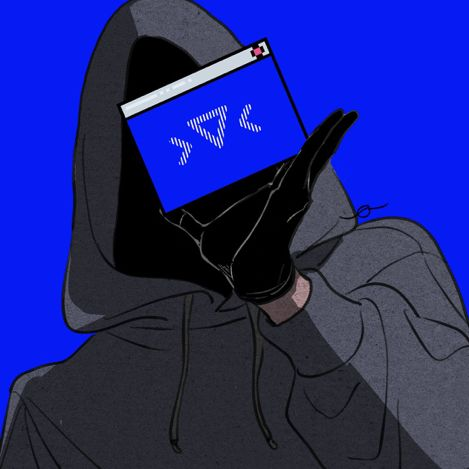
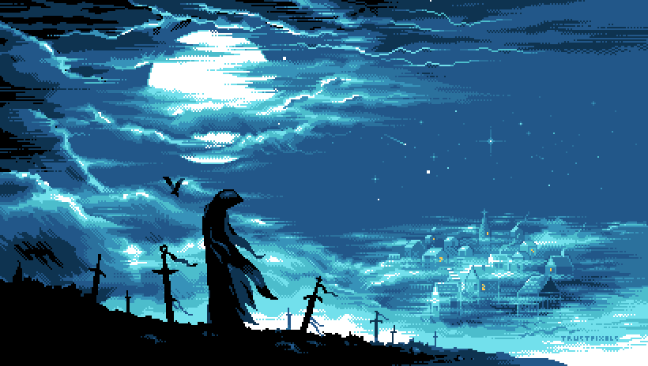

# Hi, I'm Rami Bitar 👋

 

## 💻 What I Work With

 

## 🧑‍💻 About Me

- 🔭 Currently studying Computer Programming, focused on backend & automation
- 🌱 Learning more about backend frameworks and API design
- 🤝 Open to connecting with developers, students, and companies
- 📫 Reach me at **ramibitar.connect@gmail.com**

 

## 📊 GitHub Stats

 

 

## 🏆 Achievements

 

## 🚀 Featured Projects

| Project | Description | Tech |
|---|---|---|
| **[Project Name](https://github.com/RamiDevX)** | Short description of what it does | `Python` `SQL` |
| **[Project Name](https://github.com/RamiDevX)** | Short description of what it does | `JavaScript` `REST API` |
| **[Project Name](https://github.com/RamiDevX)** | Short description of what it does | `Arduino` `C++` |

 

## 🌐 Connect With Me

 

---

⭐ **Thanks for visiting my profile!**

