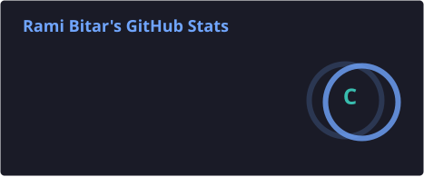

# Hi, I'm Rami Bitar 👋

 

## 🚀 Featured Projects

<table width="100%" style="border-collapse: collapse; border: none;">
  <!-- NoorifyBot Project -->
  <tr>
    <td width="25%" align="center" style="padding: 15px;">
      
    </td>
    <td width="75%" style="padding: 15px;">
      <h3>🕌 NoorifyBot</h3>
      
A Telegram bot delivering scheduled Quran verses, Hadiths & Islamic reminders to keep users connected to their faith.

      

        
        
        
      

      
    </td>
  </tr>
  
  <!-- Safaa AI Project -->
  <tr>
    <td width="25%" align="center" style="padding: 15px;">
      
    </td>
    <td width="75%" style="padding: 15px;">
      <h3>🎵 Safaa AI</h3>
      
An AI-powered Telegram bot that elegantly isolates vocals from music tracks using the Demucs source separation model.

      

        
        
        
      

      
    </td>
  </tr>

  <!-- Khulasa AI Project -->
  <tr>
    <td width="25%" align="center" style="padding: 15px;">
      
    </td>
    <td width="75%" style="padding: 15px;">
      <h3>📝 Khulasa AI</h3>
      
A privacy-first meeting summarizer — turns voice recordings into accurate summaries & actionable items using local AI models.

      

        
        
        
      

      
    </td>
  </tr>
</table>

  
<i>More projects coming soon.</i>

 

  

 

## 👨‍💻 About Me

  <table>
    <tr>
      <td width="50%" valign="top">
        <h3 align="center">🎯 What I Do</h3>
        

          
            
          Computer Programming student passionate about building <b>practical, real-world software</b> that solves actual problems.
        

        

          <table>
            <tr>
              <td>🏗</td>
              <td><b>Designing & implementing REST APIs</b></td>
            </tr>
            <tr>
              <td>💾</td>
              <td><b>Structuring databases efficiently</b></td>
            </tr>
            <tr>
              <td>🤖</td>
              <td><b>Building AI-powered automation tools</b></td>
            </tr>
            <tr>
              <td>📱</td>
              <td><b>Developing Telegram bots that solve real problems</b></td>
            </tr>
          </table>
        

      </td>
      <td width="50%" valign="top">
        <h3 align="center">🧠 My Philosophy</h3>
        

          
            
          Exploring where <b>automation meets AI</b> — using Python and Aiogram to build bots that actually deliver value.
        

        

          
          
          
        

         
        
<i>"Code that's readable, scalable, and easy to maintain."</i>

      </td>
    </tr>
  </table>

 

  

 

## ⚡️ Currently

  <table width="90%">
    <tr>
      <td width="50%" align="center">
        <h3>🔭 Working On</h3>
        
          
        
Turns voice recordings into accurate summaries & actionable items using <b>local AI models</b>.

      </td>
      <td width="50%" align="center">
        <h3>🌱 Learning</h3>
        
        
          
        
Deploying bots reliably with <b>Docker & CI/CD pipelines</b>.

      </td>
    </tr>
    <tr>
      <td width="50%" align="center">
        <h3>👯 Open to Collaborate</h3>
        
        
          
        
Looking for exciting projects in <b>AI-powered bots</b> and <b>backend systems</b>.

      </td>
      <td width="50%" align="center">
        <h3>💬 Ask Me About</h3>
        

          
          
          
          
          
        

         
        
Always happy to discuss <b>Python, bots, APIs & local AI</b>!

      </td>
    </tr>
  </table>

 

## 📊 GitHub Stats

  
  

 

## 🛠 Tech Stack

  

 

  Also working heavily with: <b>Aiogram</b> · <b>Ollama</b> · <b>Whisper</b> · <b>Demucs</b>

 

## 🌐 Connect with Me

 

  
<b>Thanks for stopping by! 🙌</b>

